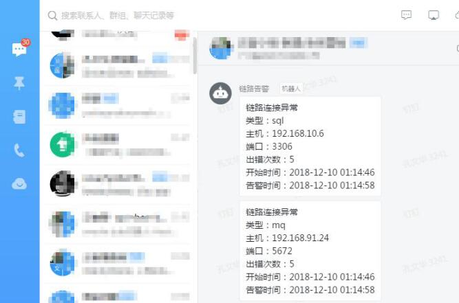
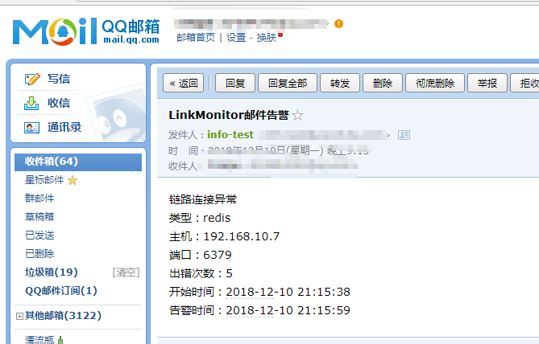

# swoole-link-monitor

基于swoole timer/table/process(worker) 实现链路监控与告警

* 基于swoole独立部署 
> * timer   定时器
> * process 多进程队列模式消费监听链路
> * table   内存表记录出错次数与时间
* 无限扩展链路类型
* 无限扩展告警类型


## 链路支持

> * rabbitmq
> * mysql  
> * redis  
> * api    开发ING
> * ... （待扩展）

## 告警支持

> * 钉钉告警
> * 邮件告警
> * ...  （待扩展）

## 架构图


## 告警示例图




## 安装要求

> * php >= 7.0
> * swoole >= 1.9.18
> * amqp >= 1.6.0
> * redis

## 安装方式
```
git clone https://github.com/kbigbus/swoole-link-monitor
cd swoole-link-monitor
composer install
chmod u+x link-monitor
```

## 配置调整

参见 [config.md](docs/config.md)

## 执行方式

> php link-monitor